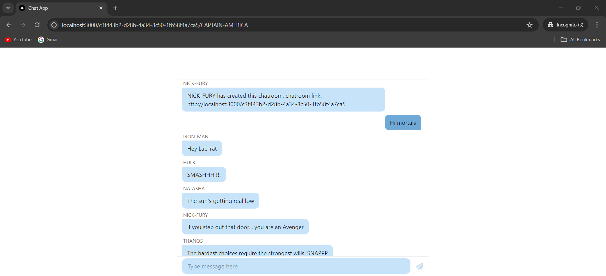

# Chat App

Welcome to the Chat App! This application allows users to create chat rooms and communicate in real-time. Built with Next.js and Tailwind CSS, it's designed to be simple and user-friendly.

## Features

- **Create Chat Rooms**: Users can create chat rooms by entering their name.
- **Real-Time Messaging**: Send and receive messages in real-time.
- **Responsive Design**: Works well on both desktop and mobile devices.

## Technologies Used

- **Next.js**: A React framework for building server-side rendered applications.
- **Tailwind CSS**: A utility-first CSS framework for styling.
- **AWS Amplify**: For backend services and GraphQL API.
- **Chat UI Kit**: For chat interface components.

## Demo



This is a screenshot of the chat app in action.


## Getting Started

To get a local copy of the project up and running, follow these steps:

### Prerequisites

- Node.js (version X or later)
- npm or yarn

### Installation

1. Clone the repo:
   ```bash
   git clone https://github.com/malaythakur/InviteChatApp.git
   ```

2. Navigate to the project directory:
   ```bash
   cd chat-app-on-aws
   ```

3. Install the dependencies:
   ```bash
   npm install
   # or
   yarn install
   ```

4. Configure AWS Amplify:
   - Update the `amplifyconfiguration.json` file with your AWS settings.

5. Run the application:
   ```bash
   npm run dev
   # or
   yarn dev
   ```

6. Open your browser and navigate to `http://localhost:3000`.

## Things to Improve

- **Authentication**: Implement user authentication to enhance security and user experience.
- **UI/UX Enhancements**: Improve the design and user interface.

## Contributing

Contributions are welcome! If you'd like to contribute to the project, please fork the repository and create a pull request. You can help with features, bug fixes, or improvements.

### Steps to Contribute

1. **Fork the repository**:
   - Click the "Fork" button at the top-right corner of the repository page to create a copy of the repository under your GitHub account.

2. **Clone the forked repository**:
   - Clone your forked repository to your local machine:
     ```bash
     git clone https://github.com/malaythakur/InviteChatApp.git
     ```

3. **Create your feature branch**:
   - Navigate to the project directory and create a new branch from `development`:
     ```bash
     git checkout development
     git checkout -b feature/YourFeatureName
     ```

4. **Commit your changes**:
   - Make your changes and commit them:
     ```bash
     git commit -m 'Add some feature'
     ```

5. **Push to the branch**:
   - Push your changes to your forked repository:
     ```bash
     git push origin feature/YourFeatureName
     ```

6. **Open a pull request**:
   - Go to the original repository where you want to submit your changes.
   - You will see a prompt to compare your branch. Click on "Compare & pull request."
   - Add a title and description for your pull request, explaining the changes you made.
   - Ensure the base branch is set to `development` and the compare branch is set to your feature branch (e.g., `feature/YourFeatureName`).
   - Click on "Create pull request" to submit it.
## Contact

[Malay Thakur](malaythakur13@gmail.com)

[https://github.com/malaythakur/InviteChatApp.git](https://github.com/malaythakur/InviteChatApp.git)
